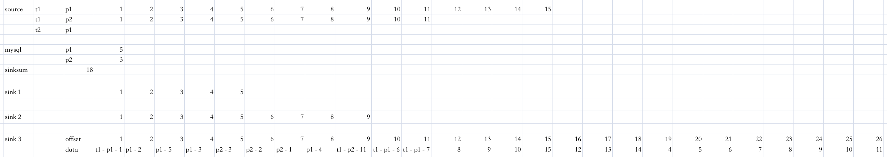

# 统一数据实时导入系统

source[multiple kafka(multiple topics)]
-> transformation(metadata from mysql)
-> sink[kafka(topic)]

## 功能特点
- Sink Kafka 存储符合神策格式的 JSON 数据
- 数据源，仅支持 Kafka，可支持多 Kafka 集群、多 topic 的多源配置
- 数据格式，默认支持 JSON 格式，可插件化开发其他格式到 JSON 格式的转换逻辑
- 数据类型，主要支持 track 类型，profile 及 item 相关类型已定义，需在主逻辑中添加对应解析
- 转化为神策格式，支持插件化开发各种解析逻辑，用于定义原始数据如何转化为符合神策格式的数据，例如：
  - event 应该对应原始数据中哪个字段？
  - time 应该对应原始数据中哪个字段？
  - distinct_id 原始数据中哪个字段？
  - 如何判断原始数据为登录后数据还是登录前数据，即怎么判断 $is_login_id 的取值
  - 可添加拆分逻辑
- 用户关联，仅支持 2.0
- 字段转译，非神策关键字段，均全小写原名 + 原值进行导入，如需对原字段名进行更名，可进行配置

## 目录结构
DB - 行内定义的 SQL 发布文件结构
com.sensorsdata.analytics
- bean - bean 类
- connectors.kafka - kafka connector 类
- constants - 常数类
- transformation - 算子定义/数据处理类
  - broadcast - 广播算子定义类
  - converter - 格式转换类
  - processor - 数据处理类
  - TransFactory - 主逻辑算子定义类 
- utils - 工具类
- FlinkMain - 主程序

## 程序逻辑
1. 读取 RDM 配置，获取当前环境应使用配置文件名
2. 读取本地配置 application-<env>.properties（由上一步决定） 
3. 配置 Flink 环境，包括重启策略、checkpoint 配置和全局配置
4. 初始加载 MySQL 元数据一次 
5. 不重不漏机制，配置从历史已发送的最大 offset 开始继续读取 
6. 如有通过 RDM 配置赋值 startTimeStamp，则覆盖前一步的配置，转而配置从 startTimeStamp 后最近的数据开始读取 
7. 根据元数据配置 kafka 数据源从 Kafka 开始消费，算子名以 -source 结尾
8. 每个数据源对应一个单并行度统计算子用于每次 checkpoint 往 MySQL 写入 kafka offset 记录
9. 每个数据源对应一个格式转换算子，算子名以 -map 结尾，用于确保进入主逻辑算子的数据均为 JSON 格式
   1. 此处有插件化格式转换方法可添加，具体方式见「插件化开发」
10. 增加广播流用于定期将 MySQL 元数据读取并应用于主逻辑算子中 
11. 定义旁路输出用于记录非法数据 
12. 定义旁路输出用于每次 checkpoint 往 MySQL 写入全流程各节点处理数据的条数统计 
13. 配置主数据流首先连接元数据广播流，然后定义旁路输出后开始进行正式数据处理逻辑 
    1. 此处有插件化数据处理方法可添加，具体方法见「插件化开发」
    2. 此处有插件化登录事件处理方法可添加，具体方法见「插件化开发」
14. 将处理后数据直接发往下游 Kafka 
15. 将旁路的非法数据发往下游 Kafka 另一 Topic

## 插件化开发
### 数据格式转换
- 背景：在格式转换算子中，程序默认读取 JsonNode，如发现 ConsumerRecord<byte[], byte[]>.value() 不是 JSON 格式，读取数据格式转换插件
- 框架已定义函数式接口 KafkaJsonConverter
  - 输入：Kafka 数据格式 ConsumerRecord<byte[], byte[]>
  - 输出：jackson.JsonNode
- 插件化开发可在 ConverterFamily 统管类中根据业务需求定义新的 KafkaJsonConverter 对应不同格式
  - 默认存在 emptyConverter，无任何逻辑，直接创建空 JsonNode 在后续处理中直接记录数据位置并发往非法 topic
  - 示例 csvConverter，仅供参考或未来修改后使用，无需的话可删除
- 完成新的 KafkaJsonConverter 开发后，将新的 KafkaJsonConverter 加入 ConverterFamily.CONVERTER_MAP
- 在配置文件 application-<env>.properties 中，找到 ## KafkaJsonConverter 的部分，将新的 KafkaJsonConverter 匹配上对应生效的数据源
  - 配置格式为 <kafka_server_port>.<kafka_topic>=<KafkaJsonConverter_name>
  - key 部分需要将所有标点换成 "."
- 完成配置后，在格式转换算子中，就会对应数据源信息读取对应的 KafkaJsonConverter 进行数据格式转换

### 数据处理
- 背景：在主逻辑算子中，程序需要读取数据处理插件将传入的 JsonNode 转化为神策格式的数据，程序中定义为 SourceBaseEntity 
- 框架已定义函数式接口 JsonProcessor
    - 输入：jackson.JsonNode，即上一转换的输出
    - 输出：List<SourceBaseEntity>，因考虑到一拆多的可能性，以 list 形式输出
- 插件化开发可在 ProcessorFamily 统管类中根据业务需求定义新的 JsonProcessor 对应不同格式
    - 对公旧数据格式 corpBankOldEven，含特殊格式切割，一拆多，关键字段对应
    - 对公新数据格式 corpBankNewEvent，标准 JSON 格式，仅含关键字段对应
    - 目前的默认插件，统一日志平台数据格式 uniLogPlatformEvent，标准 JSON 格式，仅含关键字段对应
- 完成新的 JsonProcessor 开发后，将新的 JsonProcessor 加入 ProcessorFamily.JSON_PROCESSOR_MAP
- 在配置文件 application-<env>.properties 中，找到 ## JsonProcessor 的部分，将新的 JsonProcessor 匹配上对应生效的数据源
    - 配置格式为 <kafka_server_port>.<kafka_topic>=<JsonProcessor_name>
    - key 部分需要将所有标点换成 "."
- 完成配置后，在主逻辑算子中，就会对应数据源信息读取对应的 JsonProcessor 进行数据处理

### 登录数据特殊处理（用户关联 2.0）
- 背景：在主逻辑算子最后，程序需要读取登录事件处理插件判断处理完的 SensorsEventBean 是否符合业务定义的登录事件
- 框架已定义函数式接口 PostProcessor
    - 输入：SensorsEventBean，符合神策格式的数据
    - 输出：boolean，true 即为登录事件，false 反之
- 插件化开发可在 ProcessorFamily 统管类中根据业务需求定义新的 PostProcessor 对应不同格式
    - 目前的默认插件，统一日志平台登录数据处理 uniLogPlatformPost，判断事件名是否为 "Login" 或 "register"，且是否同时含有登录 ID 和设备 ID
- 完成新的 PostProcessor 开发后，将新的 PostProcessor 加入 ProcessorFamily.POST_PROCESSOR_MAP
- 在配置文件 application-<env>.properties 中，找到 ## PostProcessor 的部分，将新的 PostProcessor 匹配上对应生效的数据源
    - 配置格式为 <kafka_server_port>.<kafka_topic>=<PostProcessor_name>
    - key 部分需要将所有标点换成 "."
- 完成配置后，在主逻辑算子中，就会对应数据源信息读取对应的 PostProcessor 进行登录数据处理

